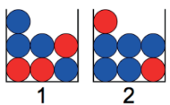

```{r setup, include=FALSE}
knitr::opts_chunk$set(echo = TRUE)
```

---

### 2.1 When rolling two dice, what is the probability that one die is twice the other?

Answer: **About 16.5%**

Solution:
```{r 2.1 Answer}
event <- replicate(10000, {
  rolls <- sample(x = 1:6, size = 2, replace = TRUE)
  rolls[1] == (rolls[2] * 2) | rolls[2] == (rolls[1] * 2)})
mean(event)
```

---

### 2.3 A hat contains slips of paper numbered 1 through 6. You draw two slips of paper at random from the hat, without replacing the first slip into the hat.

##### (a) Write out the sample space S for this experiment.

Answer: **s = {(1, 2), (1, 3), (1, 4), (1, 5), (1, 6), (2, 3), (2, 4), (2, 5), (2, 6), (3, 4), (3, 5), (3, 6), (4, 5), (4, 6), (5, 6)}**

##### (b) Write out the event *E*, “the sum of the numbers on the slips of paper is 4.”

Answer: **E = {(1, 3)}**

##### (c) Find *P*(*E*).

Answer: ***P*(*E*) = |*E*|/|*P*| = 1/15 = 6.7%**

##### (d) Let *F* be the event “the larger number minus the smaller number is 0.” What is P(F)?

Answer: **0% because the event F is not possible and therefore a null set.**

---

### 2.5 Suppose the proportion of M&M’s by color is:

| *Yellow* | *Red* | *Orange* | *Brown* | *Green* | *Blue* |
| -------- | ----- | -------- | ------- | ------- | ------ |
|0.14      | 0.13  | 0.20     | 0.12    | 0.20    | 0.21   |

##### (a) What is the probability that a randomly selected M&M is not green?

Answer: ***P*(*not green*) = 1 - *P*(*green*) = 1 - 0.2 = 0.8 = 80%**

##### (b) What is the probability that a randomly selected M&M is red, orange, or yellow?

Answer: ***P*(*red, orange, or yellow*) = *P*(*red*) + *P*(*orange*) + *P*(*yellow*) = 0.13 + 0.2 + 0.14 = 0.47 = 47%**

##### (c) Estimate the probability that a random selection of four M&M’s will contain a blue one.

Answer: **About 61%. (1 - (0.79^4) = 0.61049919)**

Solution:
```{r 2.5c Answer}
event = replicate(10000, {
    selections <- sample(x = c("Yellow", "Red", "Orange", "Brown", "Green", "Blue"), size = 4, replace = TRUE, prob = c(0.14, 0.13, 0.2, 0.12, 0.2, 0.21))
    any(selections == "Blue")
})
mean(event)
```

##### (d) Estimate the probability that a random selection of six M&M’s will contain all six colors.

Answer: **1.32% (720 x 0.14 x 0.13 x 0.2 x 0.12 x 0.2 x 0.21 = 0.013208832)**

Solution:
```{r 2.5d Answer}
event = replicate(10000, {
    selections <- sample(x = c("Yellow", "Red", "Orange", "Brown", "Green", "Blue"), size = 6, replace = TRUE, prob = c(0.14, 0.13, 0.2, 0.12, 0.2, 0.21))
    all(sort(selections) == sort(c("Yellow", "Red", "Orange", "Brown", "Green", "Blue")))
})
mean(event)
```

---

### 2.7 Blood types O, A, B, and AB have the following distribution in the United States:

| Type | *A* | *AB* | *B* | *O* |
| ------ | --- | ---- | --- | --- |
|Probability| 0.40 | 0.04 | 0.11 | 0.45 |

### What is the probability that two randomly selected people have the same blood type?

Answer: **About 37.6% (*P*(*same blood type*) = 0.4^2 + 0.04^2 + 0.11^2 + 0.45^2 = 0.3762)**

Solution:
```{r 2.7 Answer}
event = replicate(10000, {
    selections <- sample(x = c("A", "AB", "B", "O"), size = 2, replace = TRUE, prob = c(0.4, 0.04, 0.11, 0.45))
    selections[1] == selections[2]
})
mean(event)
```

---

### 2.9 Estimate the probability that exactly 3 heads are obtained when 7 coins are tossed.

Answer: **About 27.3% (35 / (2^7) = 0.2734375)**

Solution:
```{r 2.9 Answer}
event = replicate(10000, {
    selections <- sample(x = c("H", "T"), size = 7, replace = TRUE)
    sum(selections == "H") == 3
})
mean(event)
```

---

### 2.11 Suppose a die is tossed repeatedly, and the cumulative sum of all tosses seen is maintained. Estimate the probability that the cumulative sum ever is exactly 20. (Hint: the function *cumsum* computes the cumulative sums of a vector.)

Answer: **About 1.4%**

Solution:
```{r 2.11 Answer}
event = replicate(10000, {
    tosses <- sample(x = 1:6, size = 20, replace = TRUE)
    cumsum(tosses) == 20
})
mean(event)
```

---

### 2.13 In a room of 200 people (including you), estimate the probability that at least one other person will be born on the same day as you.

Answer: **About 42%**

Solution:
```{r 2.13 Answer}
birthday = 94
event = replicate(10000, {
    birthdays <- sample(x = 1:365, size = 200, replace = TRUE)
    sum(birthdays == birthday) > 0
})
mean(event)
```

---

### 2.15 Assuming that there are no leap-day babies and that all birthdays are equally likely, estimate the probability that at least **three** people have the same birthday in a group of 50 people. (Hint: try using `table`.)

Answer: **aBOUT 12.4%**

Solution:
```{r 2.15 Answer}
event = replicate(10000, {
    birthdays <- sample(x = 1:365, size = 50, replace = TRUE)
    any(table(birthdays) >= 3)
})
mean(event)
```

---

### 2.17 A standard deck of cards has 52 cards, four each of 2,3,4,5,6,7,8,9,10,J,Q,K,A. In blackjack, a player gets two cards and adds their values. Cards count as their usual numbers, except Aces are 11 (or 1), while K, Q, J are all 10. Use R to simulate dealing two cards, and compute these probabilities experimentally.

##### (a) “Blackjack” means getting an Ace and a value 10 card. What is the probability of getting a blackjack?

Answer: **About 4.8% ((4 x 16) / 1326 = 0.04826546003)**

Solution:
```{r 2.17a Answer}
event = replicate(100000, {
    hand <- sample(x = rep(c(2, 3, 4, 5, 6, 7, 8, 9, 10, 10, 10, 10, 11), times = 4), size = 2, replace = FALSE)
    11 %in% hand & 10 %in% hand
})
mean(event)
```

##### (b) What is the probability of getting 19? (The probability that the sum of your cards is 19, using Ace as 11)

Answer: **About 6% ([((4 x 4) + (16 x 4)) / 1326] = 0.06033182503)**

Solution:
```{r 2.17b Answer}
event = replicate(100000, {
    hand <- sample(x = rep(c(2, 3, 4, 5, 6, 7, 8, 9, 10, 10, 10, 10, 11), times = 4), size = 2, replace = FALSE)
    sum(hand) == 19
})
mean(event)
```

---

### 2.19 In the game of Scrabble, players make words using letter tiles. The data set `fosdata::scrabble` contains all 100 tiles. Players begin the game by drawing seven tiles from a bag of 100 tiles. Estimate the probability that a player’s first seven tiles contain no vowels. (Vowels are A, E, I, O, and U.)

##### (a) 

Answer: **About 46%**

Solution:
```{r 2.91a Answer}
library(fosdata)
event = replicate(10000, {
    tiles <- sample(x = scrabble$piece, size = 7, replace = FALSE)
    c("A", "E", "I", "O", "U") %in% tiles
})
mean(event)
```

---

### 2.21 A hat contains six slips of paper with the numbers 1 through 6 written on them. Two slips of paper are drawn from the hat (without replacing), and the sum of the numbers is computed.

##### (a) What is the probability that the sum of the numbers is exactly 10?

Answer: **There are 15 possible combinations of paper slips. Of the 15 combinations, only the pairs {6, 4} sums to 10. Therefore the probability is 1/15 = 0.0666 = 6.7%**

##### (b) What is the probability that the sum of the numbers is at least 10?

Answer: **only the pairs {6, 4} and {6, 5} sums to at least 10. Therefore the probability is 2/15 = 0.13333 = 13.3%**

##### (c) What is the probability that the sum of the numbers is exactly 10, given that it is at least 10?

Answer: **We define the event *A* to be pairs of paper slips that sum to 10 and event *B* to be the pairs of paper slips that sum to at least 10. Then the probability *P*(*A*|*B*) = P*(*A* and *B*) / P*(*B*) = (1/15) / (2/15) = 1/2 = 50%.**

---

### 2.23 Suppose you do an experiment where you select ten people at random and ask their birthdays. Here are three events:
### - *A* : all ten people were born in February.
### - *B* : the first person was born in February.
### - *C* : the second person was born in January.

##### (a) Which pair(s) of these events are disjoint, if any?

Answer: **Only *A* and *C* are disjoint. The event *C* cannot occur given *A* occurs and vice versa.**

##### (b) Which pair(s) of these events are independent, if any?

Answer: **Only *B* and *C* are independent. *P*(*B* and *c*) = *P*(*B*) x *P*(*C*)**

##### (c) What is *P*(*B*|*A*)?

Answer: ***P*(*B*|*A*) = 1 = 100%**

---

### 2.25 In an experiment where you toss a fair coin twice, define events:
### - *A* : the first toss is heads.
### - *B* : the second toss is heads.
### - *C* : both tosses are the same.
### Show that *A* and *B* are independent. Show that *A* and *C* are independent. Show that *B* and *C* are independent. Finally, show that *A*, *B*, and *C* are **not** mutually independent.

Answer: **
- Show that *A* and *B* are independent: *P*(*A* and *B*) = 1/2 x 1/2 = 1/4 = *P*(*A*)*P*(*B*) = 1/2 x 1/2 = 1/4
- Show that *A* and *C* are independent: *P*(*A* and *C*) = 1/4 = *P*(*A*)*P*(*C*) = 1/2 x 2/4 = 2/8 = 1/4
- Show that *B* and *C* are independent: *P*(*B* and *C*) = 1/4 = *P*(*B*)*P*(*C*) = 1/2 x 2/4 = 2/8 = 1/4
- Show that *A*, *B*, and *C* are **not** mutually independent: *P*(*A* and *B* and *C*) = 1/4, *P*(*A*)*P*(*B*)*P*(*C*) = 1/2 x 1/2 x 2/4 = 1/8
**

---

### 2.27 Suppose you have two coins that land with heads facing up with common probability *p*, where 0 < *p* < 1. One coin is red and the other is white. You toss both coins. Find the probability that the red coin is heads, given that the red coin and the white coin are different. Your answer will be in terms of *p*.

Answer: **We define the event *A* as the red coin landing with heads face up and the event *B* as both coins landing on different faces. Then *P*(*A*|*B*) = *P*(*B*|*A*)*P*(*A*) / (*P*(*B*|*A*)*P*(*A*) + *P*(*B*|*not A*)*P*(*not A*)) = ([1 - p] x p) / ([(1 - p) x p] + (p x (1 - p))) = (p - p^2) / 2(p - p^2) = 1/2 = 50%**

---

### 2.29 Ultimate frisbee players are so poor they don’t own coins. So, team captains decide which team will play offense first by flipping frisbees before the start of the game. Rather than flip one frisbee and call a side, each team captain flips a frisbee and one captain calls whether the two frisbees will land on the same side, or on different sides. Presumably, they do this instead of just flipping one frisbee because a frisbee is not obviously a fair coin - the probability of one side seems likely to be different from the probability of the other side.

##### (a) Suppose you flip two fair coins. What is the probability they show different sides?

Answer: **There are four possible combinations of faces that two coins could land on. There are two sets of possibilities where each coin lands on a different face. Therefore the probability is 50%.**

##### (b) Suppose two captains flip frisbees. Assume the probability that a frisbee lands convex side up is *p*. Compute the probability (in terms of *p*) that the two frisbees match.

Answer: ***P*(*same faces*) = *P*(*both up*) + *P*(*both down*) = (p * p) + [(1 - p) * (1 - p)]**

##### (c) Make a graph of the probability of a match in terms of *p*.

Solution:
```{r 2.29c Answer}
p_vals <- seq(0, 1, length.out = 101)
prob_match <- p_vals^2 + (1 - p_vals)^2

plot(
    p_vals, prob_match,
    type = "l",
    xlab = "p",
    ylab = "Probability of Matching",
    main = "Probability Frisbees Match vs. p"
)
```

##### (d) One Reddit user flipped a frisbee 800 times and found that in practice, the convex side lands up 45% of the time. When captains flip, what is the probability of “same?” What is the probability of “different?”

Answer: **
- Probility of "same": (p * p) + [(1 - p) * (1 - p)] = (0.45 * 0.45) + [(1 - 0.45) * (1 - 0.45)] = 0.2025 + 0.3025 = 0.505 = 50.5%
- Probability of "different": 1 - 0.505 = 0.495 = 49.5%
**

Solution:
```{r 2.29d Answer}
p_vals <- seq(0, 1, length.out = 101)
prob_match <- p_vals^2 + (1 - p_vals)^2

plot(
    p_vals, prob_match,
    type = "l",
    xlab = "p",
    ylab = "Probability of Matching",
    main = "Probability Frisbees Match vs. p"
)

p_special <- 0.45
prob_special <- p_special^2 + (1 - p_special)^2
points(p_special, prob_special, 
       col = "red", pch = 19, cex = 1.5)
```

##### (e) What advice would you give to an ultimate frisbee team captain?

Answer: **I would advise the captain to choose matching sides since the probability of boths frisbees landing on the same side is 1% higher than not matching.**

##### (f) Is the two-frisbee flip better than a single-frisbee flip for deciding the offense?

Answer: **Yes. A single flip has a 10% difference in probability of deciding the offense while two-frisbee slips only differ by 1%.**

---

### 2.31 Suppose that there are two boxes containing marbles.


### Box 1 contains 3 red and 4 blue marbles. Box 2 contains 2 red and 5 blue marbles. A single die is tossed, and if the result is 1 or 2, then a marble is drawn from box 1. Otherwise, a marble is drawn from box 2.

##### (a) What is the probability that the marble drawn is red?

Answer: **((1/3) * (3/7)) + ((2/3) * (2/7)) = 0.33333333333 = 33.3%**

Solution:
```{r 2.31a Answer}

```

##### (b) What is the probability that the marble came from box 1 given that the marble is red?

Answer: **We define the event *A* as a the marble coming from box 1 and the event *B* as the marble being red. Then *P*(*A*|*B*) = *P*(*A* and *B*) / *P*(*B*) = ((1/3) * (3/7)) / (1/3) = 0.42857142857 = 42.9%**

---

### 2.33 How many ways are there of getting 4 heads when tossing 10 coins?

Answer: **210**

Solution:
```{r 2.33 Answer}
choose(10, 4)
```

---

### 2.35 Six standard six-sided dice are rolled.

##### (a) How many outcomes are there?

Answer: **6^6 = 46656 outcomes**

##### (b) How many outcomes are there such that all of the dice are different numbers?

Answer: **6! = 720 different numbers**

##### (c) What is the probability that you obtain six different numbers when you roll six dice?

Answer: **720 / 46656 = 0.01543209876 = 1.5%**